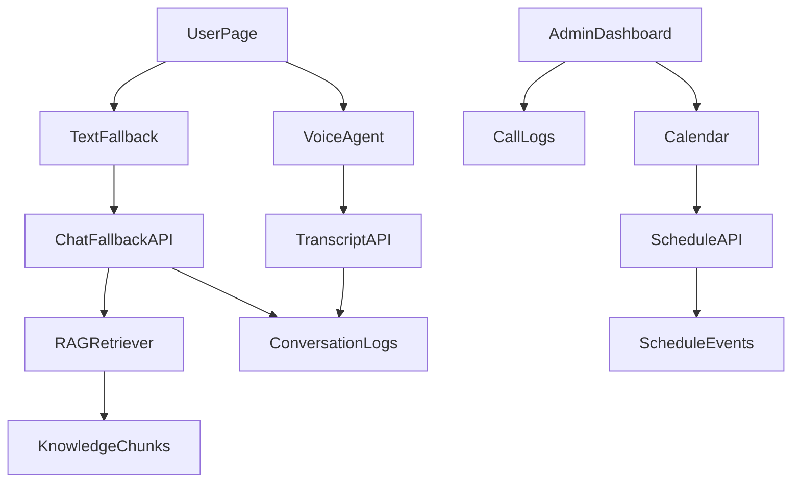

# Admin And User UX Plan

## Scope

Build this as a hackathon-friendly demo layer on the existing app:

- Admin sees four sidebar areas: `Dashboard`, `Calendar`, `Room Info`, and `Call Logs`.
- User sees the voice agent plus a typing fallback.
- Voice and typed conversations are saved as call logs visible to Admin.
- Calendar data is derived from unit viewing slots and special inquiry schedules, then updated when user/admin actions create or change schedules.

## Admin Sidebar Changes

Replace the current `LandlordDashboard` tab set in `[sample_project/components/LandlordDashboard.tsx](sample_project/components/LandlordDashboard.tsx)`:

- `Dashboard`
  - Show unit cards with vacancy/occupancy status from `RentalUnit.availability`.
  - Show today's plans: unit viewings and scheduled calls.
  - Pull from landlord units plus persisted schedule/call-log data.
- `Calendar`
  - Replace or refactor `[sample_project/components/ViewingScheduleManager.tsx](sample_project/components/ViewingScheduleManager.tsx)` into a calendar-style schedule organizer.
  - Represent both viewing appointments and special inquiry calls.
  - Allow admin to add/edit/delete schedule events.
- `Room Info`
  - Reuse/refine `[sample_project/components/UnitKnowledgeBaseEditor.tsx](sample_project/components/UnitKnowledgeBaseEditor.tsx)`.
  - Emphasize editable fields: unit rules, pets allowed, cost/payment terms, advance/deposit requirements, and status `Vacant/Occupied`.
- `Call Logs`
  - Rename/refine `[sample_project/components/TranscriptViewer.tsx](sample_project/components/TranscriptViewer.tsx)`.
  - Show voice and typed fallback conversations from users.

## User Page Changes

Update `[sample_project/components/CallInterface.tsx](sample_project/components/CallInterface.tsx)`:

- Keep the current voice call flow.
- Add a typing fallback panel below or beside the voice controls.
- The fallback sends messages to a new API route, for example `[sample_project/app/api/chat-fallback/route.ts](sample_project/app/api/chat-fallback/route.ts)`.
- The fallback route uses the existing landlord/unit RAG helpers from `[sample_project/lib/knowledge.ts](sample_project/lib/knowledge.ts)` and prompt style from `[sample_project/lib/prompts.ts](sample_project/lib/prompts.ts)`.
- Save the typed conversation into the same call-log storage used by voice transcripts.

## Data Model Updates

Extend the current Prisma setup in `[sample_project/prisma/schema.prisma](sample_project/prisma/schema.prisma)`:

- Add `ScheduleEvent` for calendar items:
  - `id`, `landlordId`, `unitId`, `type` (`viewing` or `special_call`), `title`, `tenantName`, `tenantContact`, `startsAt`, `endsAt`, `status`, `notes`.
- Add or replace in-memory transcript storage with `ConversationLog` and `ConversationMessage`:
  - Supports `voice` and `text_fallback` sources.
  - Stores tenant/user messages, agent replies, timestamps, channel/session IDs, and linked unit/schedule where available.
- Keep `Unit.viewingSlots` initially for compatibility, but calendar should become the source of truth for appointments.

## API Updates

- `[sample_project/app/api/transcripts/route.ts](sample_project/app/api/transcripts/route.ts)`
  - Move from in-memory `Map` to Prisma-backed conversation logs.
  - Keep existing POST shape so current voice transcript saving still works.
- New `[sample_project/app/api/schedules/route.ts](sample_project/app/api/schedules/route.ts)`
  - CRUD for calendar events.
  - Admin protected for mutations.
- New `[sample_project/app/api/chat-fallback/route.ts](sample_project/app/api/chat-fallback/route.ts)`
  - Accept `{ message, session_id, landlord_id, unit_id? }`.
  - Retrieve relevant RAG chunks.
  - Generate short conversational reply.
  - Save both user message and agent reply to call logs.

## Recommended Demo Chat Implementation

For speed and reliability, use the existing `ai` / `@ai-sdk/openai` dependencies if `NEXT_LLM_API_KEY` exists. If not, return a deterministic RAG-based response from local data so the demo still works.

This keeps the fallback useful even if external LLM credentials are unavailable.

## Data Flow

## Validation

- Run Prisma generate/db push after schema changes.
- Run `pnpm run typecheck` and `pnpm run lint`.
- Manual demo checks:
  - Admin dashboard shows units and today's plans.
  - Calendar can add a viewing and a special inquiry call.
  - Room Info edits status, pets, rent, and requirements.
  - User can start a voice call.
  - User can type into fallback and receive a concise answer.
  - Admin Call Logs show both voice transcripts and typed fallback conversations.